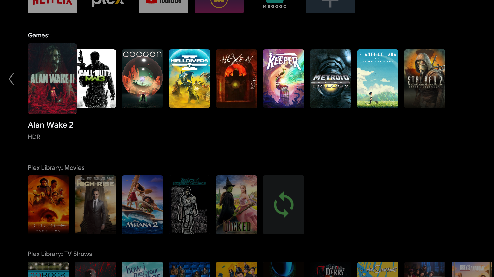
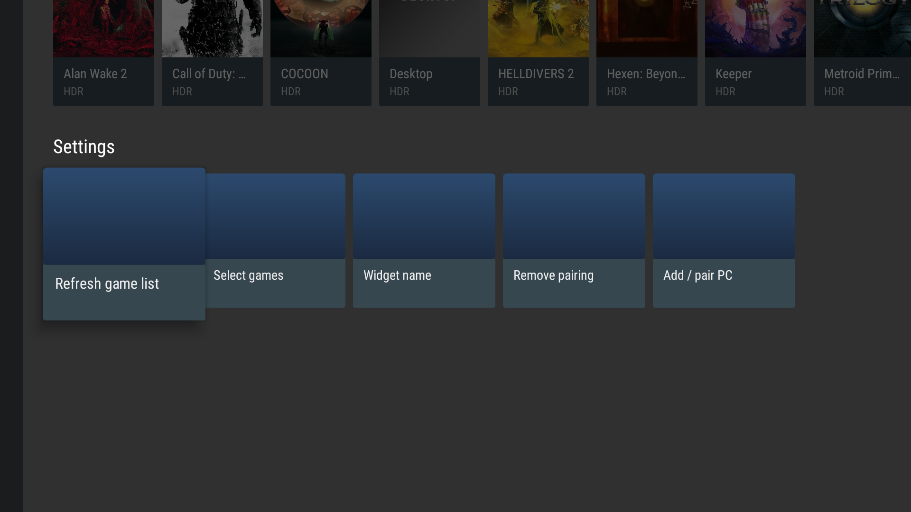
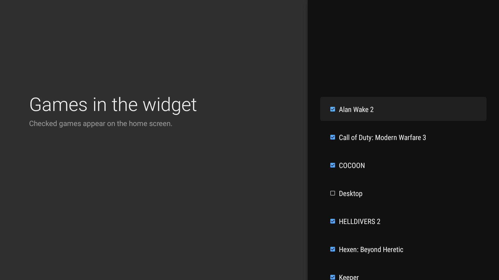

# Moonlight Android TV Widget

Легкий застосунок для **Android TV**, що виводить бібліотеку ігор з твого ПК — зі стрімінгом
через **Moonlight-сумісний хост** — прямо на головний екран як **канал-віджет** Android TV.
Вибір гри запускає її через
**[Moonlight](https://github.com/moonlight-stream/moonlight-android)**.

> 🇬🇧 In English: [README.md](README.md)



## Про проєкт

Я **не програміст** — зробив це повністю за допомогою **Claude Code**, спочатку просто для
себе. Ділюся на випадок, якщо комусь іще знадобиться.

**Pray for Ukraine!** 💙💛 🇺🇦

Розробники Moonlight можуть використовувати це як завгодно — і було б чудово побачити таку
інтеграцію на головному екрані в самому Moonlight. Я зробив усе, що хотів, тож код відкритий:
кожен охочий може взяти його й доробити під себе. 🙂

## Можливості

- 🎮 Показує бібліотеку ігор з ПК картками на **головному екрані** Android TV (preview-канал).
- 🖼️ Підтягує **обкладинки** ігор.
- ▶️ Клік **запускає гру через Moonlight** (власного стрімінгу немає — стрімить Moonlight).
- ✅ **Чекбокс для кожної гри** — обираєш, що показувати у віджеті.
- 🔤 Сортування **за алфавітом**.
- ✏️ Налаштовувана **назва віджета**.
- 🌐 Локалізації: **англійська** та **українська**.
- 🔄 Періодичне фонове оновлення списку ігор та обкладинок.

## Скриншоти

*Від парування ПК до плиток ігор на головному екрані:*

| Додати / спарувати ПК | Ввести IP ПК | Ввести PIN |
|:--:|:--:|:--:|
|  |  |  |
| **Бібліотека в застосунку** | **Вибір ігор** | **Віджет на головному екрані** |
|  |  |  |

## Як це працює

```
Цей застосунок ──(власна пара: сертифікат + PIN)──► хост на ПК
   │  читає /applist + обкладинки за протоколом GameStream
   ▼
Локальний кеш ──► Preview-канал (картки) на головному екрані Android TV
   │
   ▼ (клік на картці)
Intent → com.limelight.ShortcutTrampoline (UUID ПК + AppId)
   │
   ▼
Moonlight стрімить гру
```

### Дві окремі пари — і чому

Android ізолює застосунки, тож без root наш застосунок **не може читати дані Moonlight**. Тому:

- **Цей застосунок** парується з хостом **окремо** (свій PIN) — лише щоб читати список ігор і обкладинки.
- **Moonlight** теж має бути спарований із тим самим ПК — саме він **стрімить**.

Обидва бачать той самий `UUID` ПК (з `/serverinfo`), тож передача цього UUID у
`ShortcutTrampoline` коректно знаходить ПК у базі Moonlight.

## Вимоги

- Android TV **API 21+** (канал на головному екрані потребує **API 26+ / Android 8**).
- Встановлений **[Moonlight](https://play.google.com/store/apps/details?id=com.limelight)** з уже доданим і спарованим ПК.
- ПК із **Moonlight-сумісним хостом** та увімкненим **PIN-паруванням**.
- Обидва пристрої в одній мережі.

## Встановлення

1. Завантаж останній **`MoonlightAndroidTVWidget-x.y.apk`** зі сторінки [Releases](../../releases).
2. Встанови на Android TV:
   - **ADB:** `adb connect <IP-ТВ>:5555`, далі `adb install MoonlightAndroidTVWidget-x.y.apk`, або
   - **USB / файловий менеджер:** скопіюй APK на ТВ і відкрий (увімкни «встановлення з невідомих джерел»).

## Налаштування

1. Відкрий веб-інтерфейс свого хоста (зазвичай `https://localhost:47990`), тримай напоготові вкладку **PIN**.
2. На ТВ відкрий **Ігри** → рядок **Налаштування** → **Додати / спарувати ПК**.
3. Введи IP ПК → **Підключитися** → з'явиться 4-значний PIN.
4. Введи цей PIN у веб-інтерфейсі хоста. Список ігор синхронізується автоматично.
5. Переконайся, що **той самий ПК спарований і в Moonlight** (він стрімить).
6. Додай канал **Ігри** на головний екран через «Налаштувати канали» в лаунчері.
7. За бажанням: **Налаштування → Вибрати ігри** (що показувати) і **Назва віджета** (підпис).

## Збірка з вихідного коду

Потрібно: **JDK 17**, **Android SDK** (compile SDK 34). Gradle wrapper уже в репозиторії.

```bash
# Windows
gradlew.bat assembleDebug
# macOS / Linux
./gradlew assembleDebug
```

APK з'явиться в `app/build/outputs/apk/debug/MoonlightAndroidTVWidget-debug.apk`.
Найпростіше відкрити проєкт у **Android Studio** (він має вбудований JDK).

Це **debug-підписаний** APK — годиться для особистого встановлення й не потребує ключа. Офіційні
[релізи](../../releases) підписані **release-ключем**; щоб зібрати підписаний APK самому, додай
`keystore.properties` (він у gitignore) і виконай `gradlew assembleRelease`.

## Відомі обмеження

- Деякі лаунчери (напр. Mi TV Home) додають перед назвою каналу мітку застосунку з двокрапкою
  (`Ігри:`) — це поведінка лаунчера, прибрати через API каналів неможливо. На стоковому Android TV
  виглядає чисто.
- Обкладинки в рядку на головному екрані залежать від підтримки content-URI лаунчером; у самому
  застосунку вони показуються завжди.
- Підтримується **один ПК**. Автопошуку (mDNS) немає — IP вводиться вручну.
- Wake-on-LAN виконує Moonlight (через `ShortcutTrampoline`).

## Ліцензія та авторство

Поширюється за **GNU General Public License v3.0** — див. [LICENSE](LICENSE).

Логіку **парування та HTTP-протоколу** GameStream портовано з
**[moonlight-android](https://github.com/moonlight-stream/moonlight-android)** (GPLv3), тому цей
проєкт є похідним і ліцензується під GPLv3.
